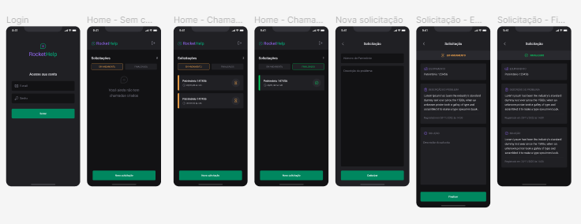

# 💻 Ignite Lab - React Native

<h4 align="center"><a href="https://www.figma.com/file/0WLgAB4bsZBJnTCS1GvmHv/Rocket-Help-Ignite-Lab-Community">Clique para visitar o figma</a></h4>

---

## 📚 Seções

O aplicativo contém as seguintes seções:

- **SignIn:** Tela de login;
- **Home:** Tela com todas as soliticações;
- **Details:** Tela com os detalhes de uma solicitação;
- **Register:** Tela para registrar uma nova solicitação;

---

## 🛠️ Desenvolvido com

Para o desenvolvimento deste aplicativo eu usei as seguintes tecnologias:

- React Native;
- React Navigation;
- Native Base;
- Expo;
- Firebase;
- Phosphor;

---

## ⚙️ Descrição

Este projeto foi desenvolvido junto a um evento realizado pela Rocketseat. O aplicativo está todo funcional e em perfeito estado para utilização.

- Auth email e senha 
- Registra solicitações
- Finaliza solicitações
- Ordena as solicitações
- Projeto bem estruturado

---

## ✒️ Autor

<table>
  <tr>
    <td align="center">
      <a href="https://github.com/Gabriellimmaa">
         
        
          <b>Gabriel Lima</b>
        
      </a>
    </td>
  </tr>
</table>

---

Obrigado por me ceder seu tempo lendo sobre o meu trabalho.

Qualquer dúvida, crítica ou sugestão entre em, <a href="mailto:gabriellimamoraes@gmail.com/">contato</a> pelo meu e-mail
